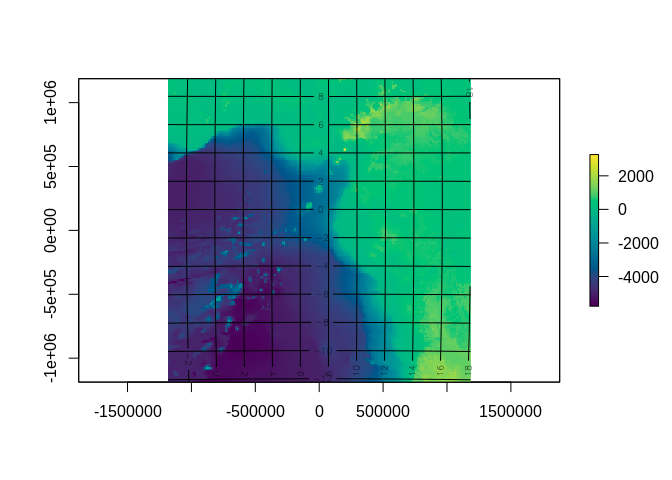
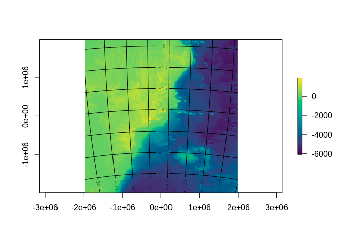
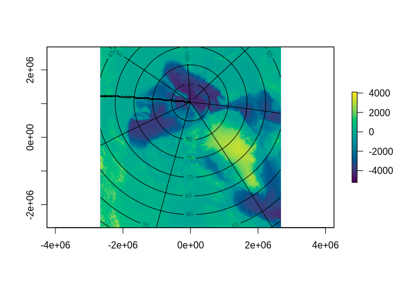
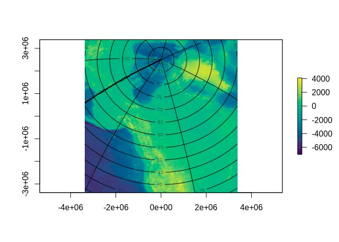

<!-- README.md is generated from README.Rmd. Please edit that file -->

# mapwtf

<!-- badges: start -->

[](https://github.com/mdsumner/mapwtf/actions)
<!-- badges: end -->

The goal of mapwtf is to plot topography for simple maps anywhere. Might
become a ‘automap()’ like the ‘SOmap\_auto()’ function in SOmap package.

## Installation

You can install from github with

``` r
remotes::install_github("mdsumner/mapwtf")
```

## Example

This is a basic example which shows you how to plot topography anywhere
in any projection on the earth. Just replace ‘reg’ with your projected
raster to fill it with elevation values using `populate_topo()`.

``` r
library(mapwtf)
for (i in seq_len(5)) {
  reg <- any_region(width = runif(1L, 50000, 5e6))
  x <- populate_topo(reg)
  raster::plot(x, col = hcl.colors(256))
  grat(x)
}
```



``` r


reg <- any_region(proj = "stere", width = 7e6, lat_0=-90, lon_0=147, lat_ts=-75)
x <- populate_topo(reg)
raster::plot(x, col = hcl.colors(256))
grat(x)
```


## Code of Conduct

Please note that the mapwtf project is released with a [Contributor Code
of
Conduct](https://contributor-covenant.org/version/2/0/CODE_OF_CONDUCT.html).
By contributing to this project, you agree to abide by its terms.
